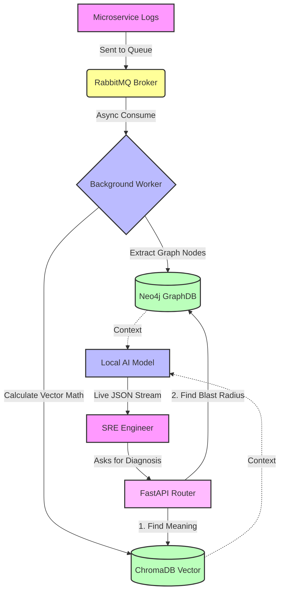

<div align="center">
  <h1>🌌 Symantix</h1>
  <p><b>An AI-Powered First Responder for Software Outages</b></p>

  <p>
    <a href="https://www.python.org/" target="_blank"></a>
    <a href="https://fastapi.tiangolo.com/" target="_blank"></a>
    <a href="https://pytorch.org/" target="_blank"></a>
    <a href="https://neo4j.com/" target="_blank"></a>
    <a href="https://www.docker.com/" target="_blank"></a>
  </p>
</div>

---

## 📖 What is Symantix?

Modern applications (like Netflix or Amazon) are built using hundreds of tiny, connected servers called "microservices". When one breaks, it causes a chain reaction, generating millions of error logs in seconds. Human engineers simply can't read them fast enough to figure out where the fire started, costing companies millions of dollars in downtime.

**Symantix is an automated, AI-powered robotic detective that solves this instantly.**

Here is exactly what we built and how it works:
1. **It listens** to all server errors in real-time as they happen (using a fast queue called RabbitMQ).
2. **It understands *what* happened** by mathematically searching the text to find the true meaning of the error, rather than just matching keywords (using a Vector Database called ChromaDB).
3. **It maps *where* it happened** by drawing a family tree of your servers to see exactly how the fire spread from one service to another (using a Graph Database called Neo4j).
4. **It tells you how to fix it** by handing this map to a highly specialized, private AI running locally on your own hardware. The AI instantly reads the map and streams a clear report to the human engineer detailing exactly what is broken and how to fix it.

Because Symantix runs entirely on local hardware, sensitive company logs are never sent to external APIs like ChatGPT, guaranteeing 100% data privacy.

---

## ⚡ Technical Features

For the engineers looking under the hood, here is how the system achieves this:

* **Hybrid GraphRAG Retrieval:** Fuses semantic meaning (Vector search) with the microservice blast-radius (Graph traversal) to completely eliminate AI hallucinations. The AI always has the perfect context.
* **Custom PyTorch Bi-Encoder:** We trained a custom AI model to read logs using **Triplet Margin Loss**. This forces the AI to learn the actual operational difference between logs, preventing it from getting confused by similar-looking error messages.
* **4-bit QLoRA Compression:** We took a powerful Language Model and compressed it down to 4-bit precision so it can run entirely on a cheap, consumer-grade GPU (under 6GB VRAM) without losing its diagnostic intelligence.
* **Event-Driven & Non-Blocking:** High-speed `aio_pika` RabbitMQ consumers handle massive log bursts during a system crash without crashing the main FastAPI server.
* **12-Factor Compliant:** Multi-stage Docker builds, safe environment variables, and non-root execution contexts ensure the app is highly secure and easy to deploy anywhere.

---

## 🏗️ System Architecture



---

## 🚀 Quick Start (Local Deployment)

Symantix is entirely containerized. You can deploy it locally in just a few minutes using Docker.

### 1. Prerequisites
- Docker & Docker Compose (v2.x) installed on your machine.

### 2. Environment Setup
Clone the repository:
```bash
git clone https://github.com/your-username/symantix.git
cd symantix
```
Copy the example environment file to activate your settings:
```bash
cp .env.example .env
```

### 3. Spin up the Infrastructure
This command downloads and starts Neo4j, ChromaDB, RabbitMQ, and the FastAPI application:
```bash
cd infra
docker-compose --env-file ../.env up -d
```

### 4. Run the Worker & Simulator
Open two new terminals in the project root to trigger the data pipeline:
```bash
# Terminal 1: Start the Async Worker (Listens for logs)
python -m backend.worker

# Terminal 2: Start the Simulator (Fakes a server crash)
python -m backend.logger_simulator
```

### 5. Diagnose an Outage
Test the AI endpoint to see it diagnose the crash you just simulated:
```bash
curl -X POST "http://localhost:8080/v1/diagnose" \
     -H "Content-Type: application/json" \
     -H "X-API-Key: your_secure_api_key_here" \
     -d '{
           "incident_description": "Database connection timeout causing 500 errors on frontend",
           "max_hops": 2
         }'
```

---

## 📂 Repository Structure

```text
Symantix/
├── backend/                  # Core Application Logic
│   ├── api.py                # FastAPI Server & Live Streaming
│   ├── worker.py             # RabbitMQ Log Consumer
│   ├── graph_store.py        # Neo4j Graph Interactions
│   ├── vector_store.py       # ChromaDB Vector Interactions
│   └── logger_simulator.py   # Generates fake server crashes
├── core-ml/                  # Machine Learning Training Scripts
│   ├── train.py              # Custom Vector AI Training
│   └── qlora_finetune.py     # Local AI Model Compression
├── infra/                    # Deployment Files
│   └── docker-compose.yml    # Database configuration
├── .env.example              # Example Configuration
└── README.md
```

---

## 🛡️ License
Distributed under the MIT License. See `LICENSE` for more information.

---
<div align="center">
  <i>Built for the future of Automated Systems Observability.</i>
</div>
